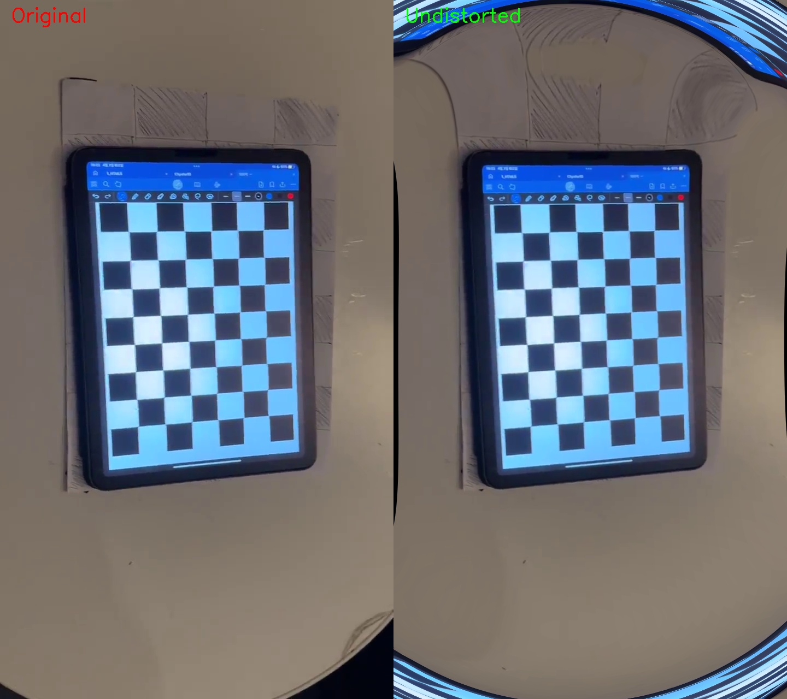
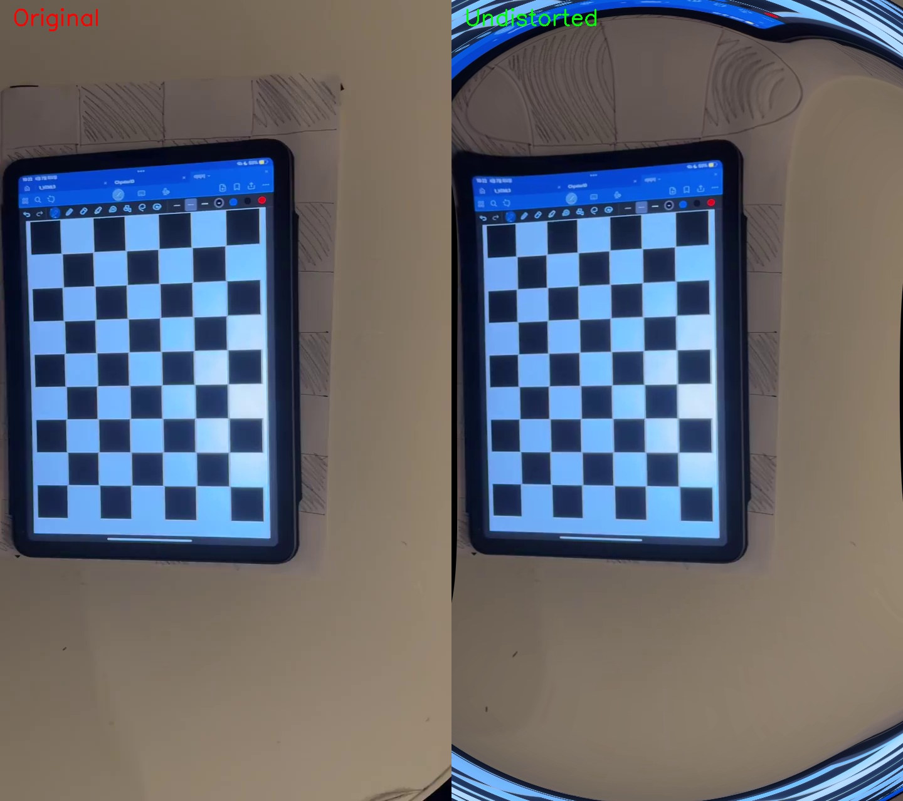
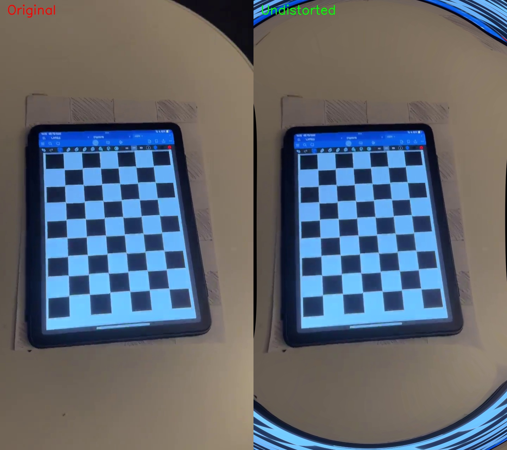
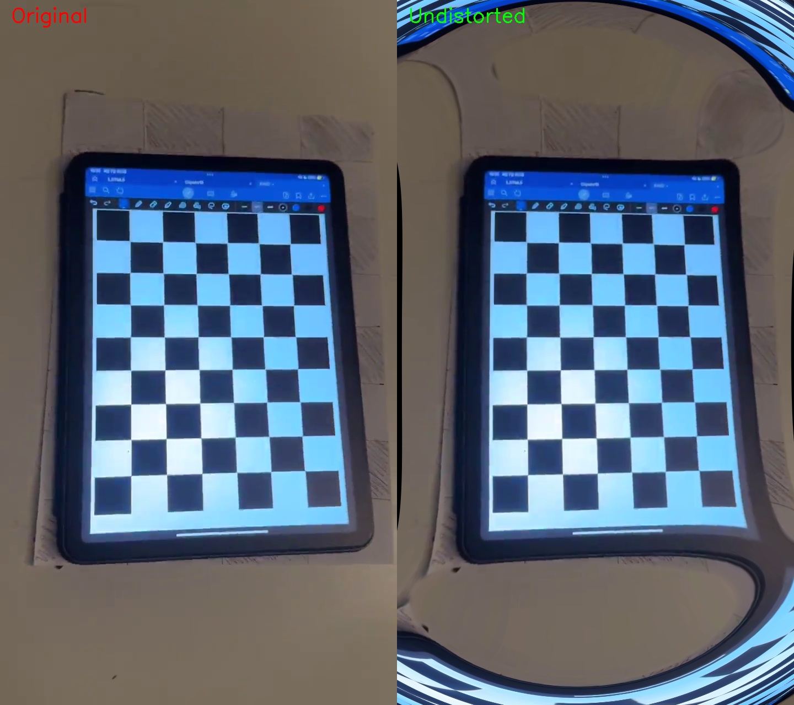
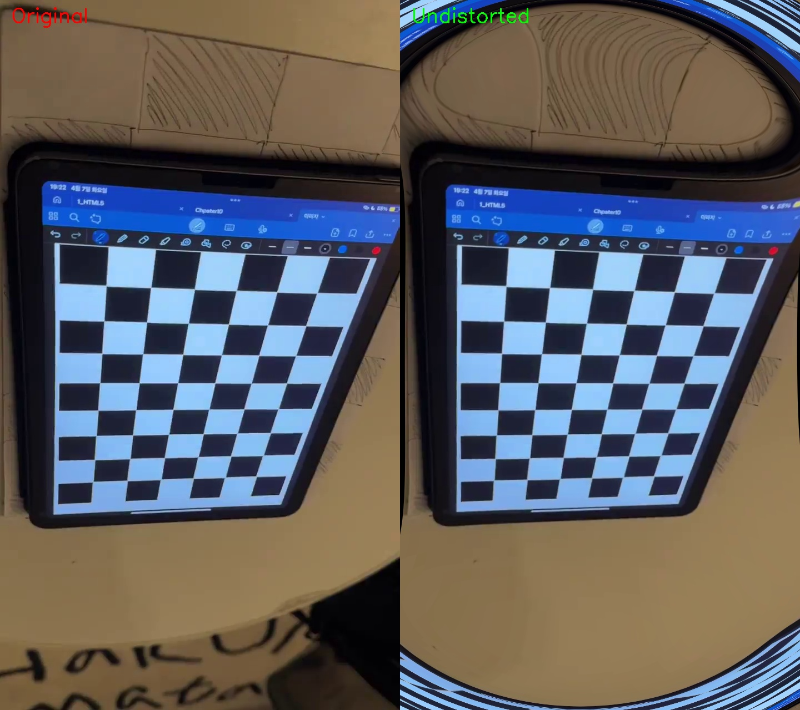

# Camera Calibration

Camera calibration and lens distortion correction using OpenCV.

## Camera Calibration Results

Calibration was performed using a chessboard pattern (6×4 inner corners) filmed with a smartphone camera.

| Parameter | Value |
|-----------|-------|
| fx | 1109.5543 |
| fy | 1101.7176 |
| cx | 326.9952 |
| cy | 632.0901 |
| k1 | 0.009409 |
| k2 | 3.579700 |
| p1 | -0.003065 |
| p2 | -0.016030 |
| k3 | -23.896812 |
| RMSE | 0.2217 pixels |

- Image resolution: 720 × 1280
- Frames used: 3

## Lens Distortion Correction

Distortion correction was applied using `cv2.undistort` with the calibrated camera matrix and distortion coefficients.

### Comparison (Original | Undistorted)

